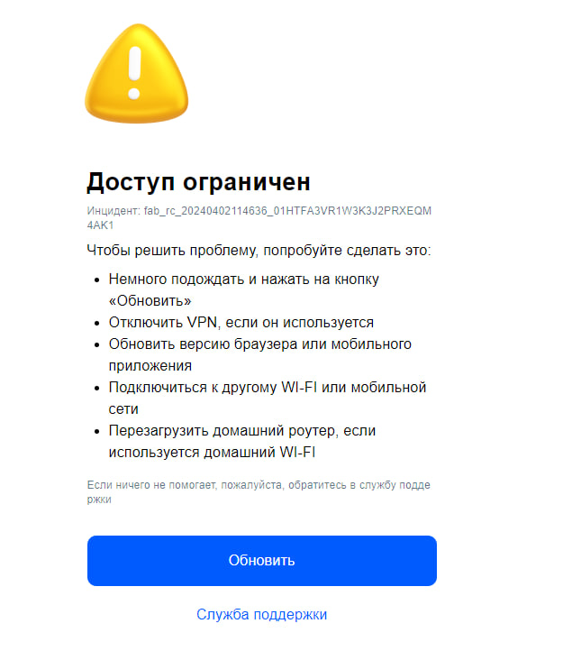
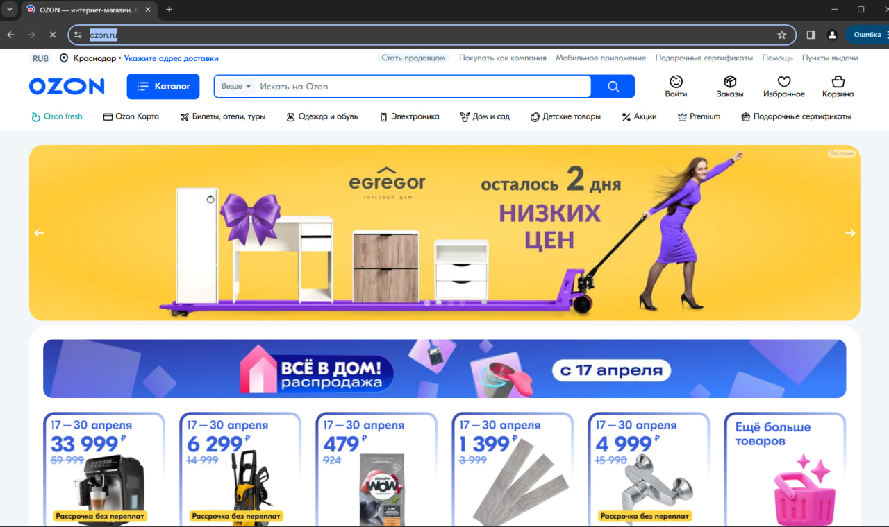

# Auto Chrome Driver
It's selenium web driver fork to bypass bot protection 

## Example

### With Selenium

```python
from selenium.webdriver import Chrome, ChromeService
from webdriver_manager.chrome import ChromeDriverManager
import time

manager = ChromeDriverManager()
chromedriver = manager.install()

driver = Chrome(service=ChromeService(executable_path=chromedriver))

driver.get('https://www.ozon.ru/')
time.sleep(5)
driver.quit()
```

### Result


### With Auto Chrome Driver
You no need to connect webdriver_manager because it's included
```python
from auto_chromedriver.driver import Driver
import time

driver = Driver()

driver.get('https://www.ozon.ru/')
time.sleep(5)
driver.quit()
```
### Result



